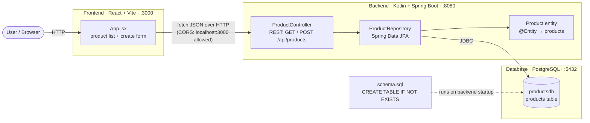

# Products App

A minimal end-to-end demo: **React** frontend → **Kotlin / Spring Boot** backend → **PostgreSQL**.
Lists products and lets you create one. Nothing more (no update/delete, minimal styling).

```
grainger1/
├── backend/     # Kotlin + Spring Boot (Gradle), REST API on :8080
├── frontend/    # React + Vite dev server on :3000
├── docs/        # Architecture diagram & notes
├── postman/     # Postman collection with embedded API tests
├── vault/       # Local dev secrets loader (DB credentials)
├── run-backend.ps1  /  run-backend.sh   # convenience launchers (load vault → start backend)
└── README.md
```

**API**

| Method | Path             | Body                | Description        |
|--------|------------------|---------------------|--------------------|
| GET    | `/api/products`  | –                   | List all products  |
| POST   | `/api/products`  | `{ "name": "P1" }`  | Create a product   |

---

## Architecture

React (Vite) → Kotlin/Spring Boot REST API → PostgreSQL.



A printable copy is at [`docs/architecture.pdf`](docs/architecture.pdf). For a
request-flow sequence diagram and component details, see
[`docs/architecture.md`](docs/architecture.md).

---

## Quick start

Full details are in the sections below; this is the short version. Commands are
shown for **Windows (PowerShell)** and **macOS / Linux (bash/zsh)**.

1. Install the [prerequisites](#prerequisites): JDK 21, Node 18+, PostgreSQL 14+.
2. Create the database (one-time; if it already exists, skip — see
   [Database setup](#database-setup)):
   ```bash
   createdb -U postgres productsdb
   ```
3. Tell the backend your Postgres password (skip if it's the default `postgres`):
   ```powershell
   # Windows (PowerShell)
   $env:DB_PASSWORD = "your-postgres-password"
   ```
   ```bash
   # macOS / Linux
   export DB_PASSWORD="your-postgres-password"
   ```
4. Start the backend (`:8080`) — from the repo root:
   ```powershell
   cd backend; .\gradlew.bat bootRun     # Windows
   ```
   ```bash
   cd backend && ./gradlew bootRun        # macOS / Linux
   ```
5. Start the frontend (`:3000`) — in a second terminal:
   ```bash
   cd frontend
   npm install        # first time only
   npm run dev
   ```
6. Open <http://localhost:3000>, add a product, and see it appear (and persist on reload).

> **Tip (avoid retyping the DB password):** the credentials live in
> `vault/secrets` (`DB_USER` / `DB_PASSWORD`). The launcher scripts load them and
> start the backend for you: `.\run-backend.ps1` (Windows) or
> `./run-backend.sh` (macOS / Linux). See [`vault/README.md`](vault/README.md).

---

## Prerequisites

- **Node** 18+ and npm (developed on Node 24 / npm 11). — <https://nodejs.org>
- **JDK 21** with `JAVA_HOME` set. `java -version` should print 21.
  (No Gradle install needed — the Gradle wrapper is included.)
- **PostgreSQL 14+** installed and running locally on `localhost:5432`.
  **No Docker required.** (During install you set a password for the `postgres`
  user — remember it; see Database setup.)

Install hints per platform:

- **Windows** — installers: [PostgreSQL](https://www.postgresql.org/download/windows/),
  [Node](https://nodejs.org), [Temurin JDK 21](https://adoptium.net). The
  PostgreSQL tools (`psql`, `createdb`) live in e.g.
  `C:\Program Files\PostgreSQL\18\bin` — add that to `PATH` or use the
  "SQL Shell (psql)" Start-menu shortcut.
- **macOS** — with [Homebrew](https://brew.sh):
  ```bash
  brew install postgresql@16 node openjdk@21
  brew services start postgresql@16      # start the DB server
  ```
  Follow the `brew info openjdk@21` hint to put JDK 21 on your `PATH` /
  `JAVA_HOME`. Homebrew's Postgres puts `psql`/`createdb` on your `PATH`.

## Database setup

The backend connects to a database named **`productsdb`** as user **`postgres`**.
You only need to **create the database** — the `products` table is created
automatically on backend startup from
[`backend/src/main/resources/schema.sql`](backend/src/main/resources/schema.sql)
(idempotent `CREATE TABLE IF NOT EXISTS`).

**1. Create the database** — a **one-time** step (pick one):

```bash
# Option A: createdb (PostgreSQL bin dir, e.g. C:\Program Files\PostgreSQL\18\bin)
createdb -U postgres productsdb

# Option B: psql (or the "SQL Shell (psql)" Start-menu shortcut)
psql -U postgres -c "CREATE DATABASE productsdb;"
```

> **Already created it (e.g. you ran this before)?** Skip this step. Running it
> again is harmless but prints `database "productsdb" already exists` and exits
> with an error — that message just means the database is already there, not that
> anything is broken. To check first, list your databases and look for
> `productsdb`:
> ```bash
> psql -U postgres -l
> ```
> Your data (the `products` table and its rows) is preserved across restarts —
> you never need to recreate the database.

**2. Credentials.** The backend defaults to username `postgres` / password `postgres`.
If your `postgres` password differs, either set env vars before starting the backend
(preferred) or edit `backend/src/main/resources/application.properties`:

```powershell
# Windows (PowerShell), per-terminal override:
$env:DB_USER = "postgres"
$env:DB_PASSWORD = "your-postgres-password"
```

```bash
# macOS / Linux (bash/zsh), per-terminal override:
export DB_USER="postgres"
export DB_PASSWORD="your-postgres-password"
```

Or, to avoid retyping it, put the values in `vault/secrets` once and use the
launcher scripts (see [Start backend](#start-backend) and
[`vault/README.md`](vault/README.md)).

For reference, the table the app creates is:

```sql
CREATE TABLE IF NOT EXISTS products (
    id   BIGINT GENERATED ALWAYS AS IDENTITY PRIMARY KEY,
    name VARCHAR(255) NOT NULL
);
```

## Start backend

Runs on **http://localhost:8080**. The Gradle wrapper is included, so no Gradle
install is needed. The `products` table is created on first startup.

```powershell
# Windows (PowerShell)
cd backend
.\gradlew.bat bootRun
```

```bash
# macOS / Linux
cd backend
./gradlew bootRun
```

**Or** use the convenience launcher, which loads `vault/secrets` (DB credentials)
and starts the backend for you — run it from the repo root:

```powershell
.\run-backend.ps1     # Windows
```

```bash
./run-backend.sh      # macOS / Linux (first time: chmod +x run-backend.sh)
```

Leave it running. Quick check (in another terminal):

```bash
curl http://localhost:8080/api/products          # -> []
```

## Start frontend

Runs on **http://localhost:3000**.

```bash
cd frontend
npm install                    # first time only
npm run dev
```

## Verify

1. Make sure Postgres is running, the backend is up on :8080, and the frontend on :3000.
2. Open **http://localhost:3000**.
3. Type **`P1`** in the box and click **Add**.
4. `P1` appears in the list below. Reload the page — it's still there (persisted in Postgres).

CLI equivalent:

```bash
curl -X POST http://localhost:8080/api/products \
  -H "Content-Type: application/json" -d '{"name":"P1"}'
curl http://localhost:8080/api/products          # -> [{"id":1,"name":"P1"}]
```

## API tests (Postman / Newman)

A Postman collection with **embedded tests** exercises both endpoints end-to-end
(list → create → whitespace-trim → blank-name rejection → list reflects creates).
See [`postman/`](postman/). With the backend running on :8080:

```bash
# headless, no install needed
npx newman run postman/products-api.postman_collection.json \
  -e postman/products-api.postman_environment.json
```

Or import the two JSON files into the Postman app and run the collection.

## Backend tests & coverage

The backend has a JUnit 5 (Kotlin) test suite with **JaCoCo** code coverage.
The tests are **hermetic** — they run against in-memory **H2** (PostgreSQL
compatibility mode), so **no Docker and no running Postgres are required**.

```powershell
# Windows (PowerShell)
cd backend
.\gradlew.bat test
```

```bash
# macOS / Linux
cd backend
./gradlew test
```

- **Coverage report:** `backend/build/reports/jacoco/test/html/index.html`
- **Test report:** `backend/build/reports/tests/test/index.html`

`.\gradlew.bat check` (and `build`) additionally enforce a **90% line-coverage**
gate via `jacocoTestCoverageVerification`.

What's covered:

- **`ProductControllerTest`** — `@WebMvcTest` slice with a mocked repository:
  list, create (201), whitespace trimming, and blank-name rejection (400).
- **`ProductRepositoryTest`** — `@DataJpaTest`: `save` assigns an id and
  `findAll` returns the persisted row.
- **`ProductApiIntegrationTest`** — `@SpringBootTest` + MockMvc end-to-end:
  context load, create → list, blank-name 400, and the CORS preflight.

Current status: **10 tests, 100% line & branch coverage** of the application
classes (the Spring Boot `main` launcher is excluded). Frontend tests are
intentionally out of scope.

## Notes

Deviations from the preferred stack, and why:

- **Spring Boot 4.1.1 + Kotlin 2.3.21** (not 3.x) — this is the current GA default
  from Spring Initializr; same programming model, just newer. Java **21**.
- **Frontend: React + Vite (plain JavaScript)**, not Create React App — CRA is
  deprecated; Vite is the current lightweight standard. Kept plain JS (no
  TypeScript) and only minimally styled per the "keep it simple, no CSS" guidance.
- **Table via `schema.sql`** run on startup, rather than a migration tool
  (Flyway/Liquibase) — plain SQL is one of the accepted options and keeps the
  demo dependency-free. Swap in Flyway later if desired.
- **CORS**: the backend allows the `http://localhost:3000` dev origin so the
  React dev server can call it directly. Demo-only; tighten for production.
- **No Docker** (by request), **no update/delete**, **no styling/hardening** —
  intentionally out of scope for this minimal, extend-it-live starter. The
  **backend does have JUnit + JaCoCo tests** (100% coverage; see above) and there
  is a Postman/Newman end-to-end suite; the **frontend intentionally has no
  tests**.
