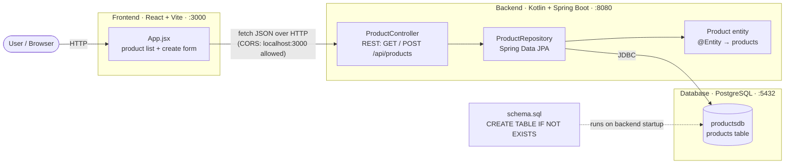
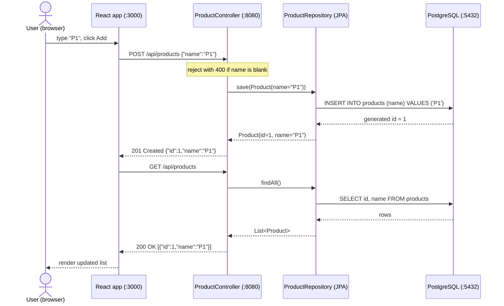

# Architecture

A minimal three-tier web application: a **React** single-page app talks over
HTTP/JSON to a **Kotlin / Spring Boot** REST API, which persists to
**PostgreSQL** via Spring Data JPA. Scope is intentionally tiny — list products
and create a product — so it stays easy to read and extend live.

The diagram below renders directly on GitHub. A printable copy is at
[`architecture.pdf`](architecture.pdf), rendered from
[`architecture.mmd`](architecture.mmd).



## Components

| Layer | Tech | Responsibility |
|-------|------|----------------|
| **Frontend** | React + Vite (plain JS), dev server on `:3000` | Renders the product list and a create form; calls the API with `fetch`. |
| **Backend** | Kotlin + Spring Boot on `:8080` | `ProductController` exposes `GET`/`POST /api/products`; `ProductRepository` (Spring Data JPA) maps the `Product` entity to the table. `WebConfig` allows the `:3000` dev origin (CORS). |
| **Database** | PostgreSQL on `:5432`, database `productsdb` | Stores products. The `products` table is created on startup by `schema.sql` (idempotent `CREATE TABLE IF NOT EXISTS`); Hibernate does not manage the schema (`ddl-auto=none`). |

## Request flow — creating a product



## Regenerating the PDF

The PDF is rendered from [`architecture.mmd`](architecture.mmd) with
[mermaid-cli](https://github.com/mermaid-js/mermaid-cli) (no global install needed):

```bash
npx -y @mermaid-js/mermaid-cli -i docs/architecture.mmd -o docs/architecture.pdf -b white -f
```

`-f` fits the page to the diagram. mermaid-cli uses Puppeteer/Chromium to render;
if you already have Chrome installed and want to avoid Puppeteer downloading its
own Chromium, point it at yours:

```bash
# puppeteer.json: { "executablePath": "<path-to-chrome>", "args": ["--no-sandbox"] }
npx -y @mermaid-js/mermaid-cli -i docs/architecture.mmd -o docs/architecture.pdf -p puppeteer.json -b white -f
```
